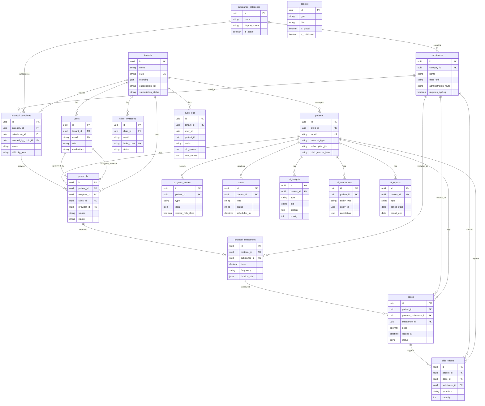

# Database Schema Guide

This document explains the database schema for the LogMyDose peptide therapy tracking platform.

## Table of Contents

- [Overview](#overview)
- [Entity Relationship Diagram](#entity-relationship-diagram)
- [Tables by Category](#tables-by-category)
  - [Tenants & Users](#tenants--users)
  - [Patients](#patients)
  - [Substances & Protocols](#substances--protocols)
  - [Tracking](#tracking)
  - [Alerts & Notifications](#alerts--notifications)
  - [AI Features](#ai-features)
  - [Content & Education](#content--education)
  - [Audit & Logging](#audit--logging)
- [Core Concepts](#core-concepts)
  - [Protocol System](#protocol-system)
  - [Dose Logging](#dose-logging)
  - [AI Insights](#ai-insights)
- [Seed Data](#seed-data)

---

## Overview

The database contains **18 tables** organized into logical groups:

| Category | Tables | Purpose |
|----------|--------|---------|
| Tenants & Users | 3 | Clinic/admin management |
| Patients | 1 | D2C and clinic-managed users |
| Substances & Protocols | 5 | Treatment plans and medications |
| Tracking | 3 | Dose logs, side effects, progress |
| Alerts | 1 | Notifications and reminders |
| AI Features | 3 | Insights, annotations, reports |
| Content | 1 | Educational materials |
| Audit | 1 | HIPAA-ready logging |

---

## Entity Relationship Diagram



### Simplified Relationship View

```
                                    ┌─────────────────┐
                                    │     TENANT      │
                                    │  (Clinic/Org)   │
                                    └────────┬────────┘
                    ┌───────────────────┬────┴────┬───────────────────┐
                    ▼                   ▼         ▼                   ▼
              ┌─────────┐        ┌──────────┐  ┌─────────┐    ┌────────────┐
              │  USERS  │        │ PATIENTS │  │ INVITES │    │ AUDIT_LOGS │
              │(Staff)  │        │(D2C/Mgd) │  │         │    │            │
              └────┬────┘        └────┬─────┘  └─────────┘    └────────────┘
                   │                  │
                   │    ┌─────────────┼─────────────┬──────────────┐
                   │    ▼             ▼             ▼              ▼
                   │ ┌──────────┐ ┌───────┐ ┌────────────┐ ┌────────────┐
                   │ │PROTOCOLS │ │ DOSES │ │SIDE_EFFECTS│ │ PROGRESS   │
                   │ └────┬─────┘ └───┬───┘ └────────────┘ └────────────┘
                   │      │           │
                   └──────┤           │         ┌─────────────────────┐
                          ▼           │         │   AI FEATURES       │
                   ┌──────────────┐   │         ├─────────────────────┤
                   │  PROTOCOL_   │◄──┘         │ • ai_insights       │
                   │  SUBSTANCES  │             │ • ai_annotations    │
                   └──────┬───────┘             │ • ai_reports        │
                          │                     └─────────────────────┘
                          ▼
              ┌───────────────────────┐
              │  SUBSTANCE_CATEGORIES │
              └───────────┬───────────┘
                          ▼
              ┌───────────────────────┐
              │     SUBSTANCES        │◄──── PROTOCOL_TEMPLATES
              │ (Peptides, Hormones)  │
              └───────────────────────┘
```

---

## Tables by Category

### Tenants & Users

#### `tenants`
Clinic/white-label instances with branding and subscription info.

| Column | Type | Description |
|--------|------|-------------|
| id | UUID | Primary key |
| name | VARCHAR(255) | Clinic name |
| slug | VARCHAR(100) | Unique slug for white-label URLs |
| branding | JSON | logo_url, primary_color, secondary_color, app_name |
| subscription_tier | VARCHAR(50) | Subscription level |
| subscription_status | VARCHAR(50) | active, cancelled, etc. |
| stripe_customer_id | VARCHAR(255) | Stripe integration |
| settings | JSON | Clinic-specific settings |

#### `users`
Providers, admins, super admins (NOT patients).

| Column | Type | Description |
|--------|------|-------------|
| id | UUID | Primary key |
| tenant_id | UUID | FK to tenants (NULL for super_admin) |
| email | VARCHAR(255) | Unique email |
| password_hash | VARCHAR(255) | Hashed password |
| role | VARCHAR(50) | super_admin, clinic_admin, provider |
| first_name | VARCHAR(100) | First name |
| last_name | VARCHAR(100) | Last name |
| credentials | VARCHAR(255) | MD, DO, NP, etc. |
| permissions | JSON | Fine-grained permissions |
| is_active | BOOLEAN | Account active status |
| token_version | INT | For refresh token invalidation |

#### `clinic_invitations`
Invite codes for patients to link with clinics.

| Column | Type | Description |
|--------|------|-------------|
| id | UUID | Primary key |
| clinic_id | UUID | FK to tenants |
| email | VARCHAR(255) | Invited email |
| invite_code | VARCHAR(50) | Unique invite code |
| status | VARCHAR(50) | pending, accepted, expired |
| expires_at | TIMESTAMP | Expiration time |

---

### Patients

#### `patients`
Unified D2C and clinic-managed users.

| Column | Type | Description |
|--------|------|-------------|
| id | UUID | Primary key |
| email | VARCHAR(255) | Unique email |
| password_hash | VARCHAR(255) | Hashed password |
| first_name | VARCHAR(100) | First name |
| last_name | VARCHAR(100) | Last name |
| date_of_birth | DATE | Birth date |
| phone | VARCHAR(20) | Phone number |
| account_type | VARCHAR(50) | d2c, clinic_managed, hybrid |
| subscription_tier | VARCHAR(50) | free, pro (for D2C) |
| subscription_status | VARCHAR(50) | Subscription status |
| stripe_customer_id | VARCHAR(255) | Stripe integration |
| clinic_id | UUID | FK to tenants (NULL = D2C user) |
| clinic_linked_at | TIMESTAMP | When linked to clinic |
| clinic_control_level | VARCHAR(50) | view_only, can_modify, full_control |
| consent_signed_at | TIMESTAMP | Consent timestamp |
| settings | JSON | Patient preferences |
| token_version | INT | For refresh token invalidation |

---

### Substances & Protocols

#### `substance_categories`
Categories like peptide, hormone, supplement, nootropic.

| Column | Type | Description |
|--------|------|-------------|
| id | UUID | Primary key |
| name | VARCHAR(100) | Internal name (peptide, hormone, etc.) |
| display_name | VARCHAR(100) | User-facing name |
| description | TEXT | Category description |
| icon | VARCHAR(50) | Icon identifier |
| is_active | BOOLEAN | Whether category is active |
| sort_order | INT | Display order |

#### `substances`
Master database of peptides, hormones, supplements with dosing info, storage requirements, cycling rules, and safety info.

| Column | Type | Description |
|--------|------|-------------|
| id | UUID | Primary key |
| category_id | UUID | FK to substance_categories |
| name | VARCHAR(100) | Substance name |
| aliases | STRING[] | Alternative names |
| subcategory | VARCHAR(100) | healing, gh_secretagogue, etc. |
| default_dose | DECIMAL | Default dose amount |
| dose_unit | VARCHAR(20) | mcg, mg, ml, iu, capsule |
| default_frequency | VARCHAR(50) | daily, 2x_daily, weekly, etc. |
| administration_route | VARCHAR(50) | injection_subq, injection_im, oral, topical, sublingual |
| preparation_instructions | TEXT | How to prepare |
| storage_temp | VARCHAR(50) | Storage temperature |
| storage_notes | TEXT | Storage instructions |
| shelf_life_days | INT | Shelf life unreconstituted |
| shelf_life_reconstituted_days | INT | Shelf life after reconstitution |
| requires_cycling | BOOLEAN | Whether cycling is required |
| common_cycle_on_weeks | INT | Weeks on cycle |
| common_cycle_off_weeks | INT | Weeks off cycle |
| contraindications | STRING[] | When not to use |
| common_side_effects | STRING[] | Expected side effects |
| interactions | STRING[] | Drug interactions |
| onset_timeline | VARCHAR(100) | When to expect results |
| is_prescription_required | BOOLEAN | Rx required flag |
| is_active | BOOLEAN | Whether active in system |

#### `protocol_templates`
Public protocol library that users can adopt.

| Column | Type | Description |
|--------|------|-------------|
| id | UUID | Primary key |
| name | VARCHAR(255) | Template name |
| description | TEXT | Template description |
| category_id | UUID | FK to substance_categories |
| substance_id | UUID | FK to substances (primary substance) |
| default_dose | DECIMAL | Starting dose |
| dose_unit | VARCHAR(20) | Dose unit |
| frequency | VARCHAR(50) | Dosing frequency |
| titration_plan | JSON | Week-by-week dose changes |
| cycle_on_weeks | INT | Weeks on cycle |
| cycle_off_weeks | INT | Weeks off cycle |
| difficulty_level | VARCHAR(50) | beginner, intermediate, advanced |
| tags | STRING[] | Searchable tags |
| use_count | INT | Popularity counter |
| is_public | BOOLEAN | Whether publicly visible |
| created_by_clinic_id | UUID | FK to tenants (if clinic-created) |

#### `protocols`
Patient's active protocols (user's actual treatment plan).

| Column | Type | Description |
|--------|------|-------------|
| id | UUID | Primary key |
| patient_id | UUID | FK to patients |
| source | VARCHAR(50) | template, clinic_assigned, custom |
| template_id | UUID | FK to protocol_templates (if from template) |
| clinic_id | UUID | FK to tenants (if clinic-managed) |
| provider_id | UUID | FK to users (assigned provider) |
| clinic_can_modify | BOOLEAN | Whether clinic can modify |
| status | VARCHAR(50) | draft, active, paused, completed |
| start_date | DATE | Protocol start date |
| end_date | DATE | Protocol end date |
| notes | TEXT | General notes |
| approved_at | TIMESTAMP | When approved by provider |
| approved_by | UUID | FK to users |

#### `protocol_substances`
Junction table linking protocols to substances with specific dosing details.

| Column | Type | Description |
|--------|------|-------------|
| id | UUID | Primary key |
| protocol_id | UUID | FK to protocols |
| substance_id | UUID | FK to substances |
| dose | DECIMAL | Actual dose amount |
| dose_unit | VARCHAR(20) | Dose unit |
| frequency | VARCHAR(50) | daily, 2x_daily, 3x_weekly, etc. |
| schedule | JSON | Specific days/times |
| titration_plan | JSON | Week-by-week dose changes |
| cycle_on_weeks | INT | Weeks on cycle |
| cycle_off_weeks | INT | Weeks off cycle |
| current_supply_amount | DECIMAL | Remaining supply |
| supply_unit | VARCHAR(20) | Supply unit |
| supply_expiration_date | DATE | When supply expires |
| notes | TEXT | Substance-specific notes |

---

### Tracking

#### `doses`
Individual dose logs.

| Column | Type | Description |
|--------|------|-------------|
| id | UUID | Primary key |
| patient_id | UUID | FK to patients |
| protocol_substance_id | UUID | FK to protocol_substances (optional) |
| substance_id | UUID | FK to substances |
| dose | DECIMAL | Amount taken |
| dose_unit | VARCHAR(20) | Unit |
| scheduled_at | TIMESTAMP | When it was supposed to happen |
| logged_at | TIMESTAMP | When it actually happened |
| status | VARCHAR(50) | taken, missed, skipped |
| administration_site | VARCHAR(50) | Injection site (left_abdomen, right_thigh, etc.) |
| notes | TEXT | User notes |
| photo_url | VARCHAR(500) | Optional photo proof |

#### `side_effects`
Reported side effects.

| Column | Type | Description |
|--------|------|-------------|
| id | UUID | Primary key |
| patient_id | UUID | FK to patients |
| dose_id | UUID | FK to doses (optional) |
| substance_id | UUID | FK to substances (optional) |
| symptom | VARCHAR(100) | Side effect name |
| severity | INT | 1-10 scale |
| duration_hours | DECIMAL | How long it lasted |
| notes | TEXT | Additional notes |
| reported_at | TIMESTAMP | When reported |

#### `progress_entries`
Photos, bloodwork, measurements.

| Column | Type | Description |
|--------|------|-------------|
| id | UUID | Primary key |
| patient_id | UUID | FK to patients |
| type | VARCHAR(50) | photo, bloodwork, measurement |
| data | JSON | Flexible storage for different types |
| file_urls | STRING[] | Associated files |
| notes | TEXT | Notes |
| shared_with_clinic | BOOLEAN | Whether shared with clinic |
| recorded_at | TIMESTAMP | When recorded |

---

### Alerts & Notifications

#### `alerts`
Refill reminders, expiration warnings, dose reminders.

| Column | Type | Description |
|--------|------|-------------|
| id | UUID | Primary key |
| patient_id | UUID | FK to patients |
| type | VARCHAR(50) | refill, expiration, storage, dose_reminder |
| title | VARCHAR(255) | Alert title |
| message | TEXT | Alert message |
| scheduled_for | TIMESTAMP | When to send |
| sent_at | TIMESTAMP | When sent |
| dismissed_at | TIMESTAMP | When dismissed |
| status | VARCHAR(50) | pending, sent, dismissed |

---

### AI Features

#### `ai_insights`
Pre-generated insight cards (patterns, progress, alerts, optimizations).

| Column | Type | Description |
|--------|------|-------------|
| id | UUID | Primary key |
| patient_id | UUID | FK to patients |
| type | VARCHAR(50) | pattern, progress, alert, optimization |
| title | VARCHAR(255) | Insight title |
| content | TEXT | Detailed explanation |
| actions | JSON | Available actions user can take |
| priority | INT | Importance (0-10) |
| context_data | JSON | Data that generated this insight |
| expires_at | TIMESTAMP | When insight becomes stale |
| dismissed_at | TIMESTAMP | When user dismissed |
| acted_on_at | TIMESTAMP | When user took action |

#### `ai_annotations`
Cached AI annotations on specific doses, bloodwork, or progress entries.

| Column | Type | Description |
|--------|------|-------------|
| id | UUID | Primary key |
| patient_id | UUID | FK to patients |
| entity_type | VARCHAR(50) | dose, bloodwork, progress |
| entity_id | UUID | ID of the specific record |
| annotation | TEXT | AI-generated context |

#### `ai_reports`
Weekly/monthly AI-generated summary reports.

| Column | Type | Description |
|--------|------|-------------|
| id | UUID | Primary key |
| patient_id | UUID | FK to patients |
| type | VARCHAR(50) | weekly, monthly |
| period_start | DATE | Report period start |
| period_end | DATE | Report period end |
| content | TEXT | Full report text |
| sections | JSON | Structured sections |

---

### Content & Education

#### `content`
Videos, articles, guides.

| Column | Type | Description |
|--------|------|-------------|
| id | UUID | Primary key |
| type | VARCHAR(50) | video, article, guide |
| title | VARCHAR(255) | Content title |
| description | TEXT | Description |
| content_url | VARCHAR(500) | For videos |
| content_body | TEXT | For articles |
| thumbnail_url | VARCHAR(500) | Thumbnail image |
| tags | STRING[] | Searchable tags |
| category_ids | UUID[] | Related substance categories |
| substance_ids | UUID[] | Related substances |
| is_global | BOOLEAN | Available to all |
| tenant_ids | UUID[] | Specific tenant access |
| is_published | BOOLEAN | Whether published |

---

### Audit & Logging

#### `audit_logs`
HIPAA-ready audit trail.

| Column | Type | Description |
|--------|------|-------------|
| id | UUID | Primary key |
| tenant_id | UUID | FK to tenants |
| user_id | UUID | Who performed action |
| patient_id | UUID | Affected patient |
| action | VARCHAR(100) | Action performed |
| table_name | VARCHAR(100) | Affected table |
| record_id | UUID | Affected record |
| old_values | JSON | Previous values |
| new_values | JSON | New values |
| ip_address | VARCHAR(45) | Client IP |
| user_agent | TEXT | Client user agent |

---

## Core Concepts

### Protocol System

The protocol system has three levels:

```
┌─────────────────────────────────────────────────────────────────────┐
│  PROTOCOL TEMPLATE (Library)                                        │
│  "Semaglutide Weight Loss Titration"                                │
│  - Public/shared template anyone can use                            │
│  - Created by clinics or system admins                              │
│  - Has default dose, frequency, titration plan                      │
└─────────────────────────┬───────────────────────────────────────────┘
                          │ User adopts template
                          ▼
┌─────────────────────────────────────────────────────────────────────┐
│  PROTOCOL (Patient's Instance)                                      │
│  "John's Semaglutide Protocol"                                      │
│  - Belongs to ONE patient                                           │
│  - Can be from template, clinic-assigned, or custom                 │
│  - Has status: draft, active, paused, completed                     │
│  - Has start/end dates                                              │
└─────────────────────────┬───────────────────────────────────────────┘
                          │ Contains one or more
                          ▼
┌─────────────────────────────────────────────────────────────────────┐
│  PROTOCOL SUBSTANCE (Specific Dosing)                               │
│  - Links a substance to the protocol                                │
│  - Patient's ACTUAL dose (may differ from template)                 │
│  - Custom schedule, titration plan                                  │
│  - Inventory tracking (supply amount, expiration)                   │
└─────────────────────────────────────────────────────────────────────┘
```

#### Real-World Example

```
TEMPLATE: "CJC-1295 + Ipamorelin Stack"
    │
    │  Sarah adopts this template
    ▼
PROTOCOL: Sarah's GH Stack (status: active, started: Jan 1)
    │
    ├── PROTOCOL_SUBSTANCE: CJC-1295
    │       dose: 100 mcg
    │       frequency: daily (before bed)
    │       current_supply: 4mg remaining
    │       expiration: Feb 15
    │
    └── PROTOCOL_SUBSTANCE: Ipamorelin
            dose: 200 mcg
            frequency: daily (before bed)
            current_supply: 8mg remaining
            expiration: Feb 20
```

#### Protocol Sources

| Source | Description |
|--------|-------------|
| `template` | User picked from library |
| `clinic_assigned` | Clinic prescribed it |
| `custom` | User built from scratch |

#### What Each Layer Provides

| Layer | Provides |
|-------|----------|
| **Substance** | HOW to use (preparation, administration, storage, safety) |
| **Protocol Substance** | WHEN and HOW MUCH (dose, frequency, schedule, titration) |
| **Protocol** | WHO and WHEN (patient, status, dates, oversight) |

---

### Dose Logging

#### Relationship Chain

```
Protocol
    │
    └── ProtocolSubstance (dosing instructions)
            │
            └── Dose (actual logged dose)
```

#### Dose Statuses

| Status | Meaning |
|--------|---------|
| `taken` | User took the dose |
| `missed` | Scheduled time passed, not logged |
| `skipped` | User intentionally skipped |

#### Logging Scenarios

| Scenario | `protocol_substance_id` | `substance_id` |
|----------|------------------------|---------------|
| Log dose from active protocol | Set | Set |
| Log ad-hoc dose (no protocol) | NULL | Set |
| Log PRN/as-needed substance | Set or NULL | Set |

The `protocol_substance_id` is optional to allow flexibility for D2C users experimenting without formal protocols, one-off doses outside regular schedules, or historical imports.

---

### AI Insights

The AI system generates three types of outputs:

#### 1. AI Insights (Proactive Cards)

Pre-generated insight cards shown on the home screen.

| Type | Example |
|------|---------|
| `pattern` | "Nausea decreases after week 3" |
| `progress` | "87% adherence this month" |
| `alert` | "Supply runs out in 5 days" |
| `optimization` | "Consider taking at night" |

#### 2. AI Annotations (Inline Context)

Cached annotations shown when viewing specific records.

Example when viewing a dose log:
```
┌─────────────────────────────────────────────────────────────────────┐
│  DOSE LOG                                        Jan 19, 8:15 AM    │
├─────────────────────────────────────────────────────────────────────┤
│  Semaglutide 0.5 mg ✓                                               │
│  Site: Left abdomen                                                 │
│  Notes: "Felt slight nausea after"                                  │
│                                                                     │
│  ┌─────────────────────────────────────────────────────────────┐   │
│  │ 🤖 AI INSIGHT                                               │   │
│  │ This is your first dose at 0.5mg after titrating up from    │   │
│  │ 0.25mg. Mild nausea is common after dose increases and      │   │
│  │ typically subsides within 2-3 days.                         │   │
│  └─────────────────────────────────────────────────────────────┘   │
│                                                                     │
└─────────────────────────────────────────────────────────────────────┘
```

#### 3. AI Reports (Periodic Summaries)

Weekly/monthly summary reports.

```
┌─────────────────────────────────────────────────────────────────────┐
│  WEEKLY REPORT                                   Jan 13-19, 2024    │
├─────────────────────────────────────────────────────────────────────┤
│                                                                     │
│  📊 ADHERENCE                                                       │
│  Semaglutide: 1/1 doses (100%)                                      │
│  BPC-157: 13/14 doses (93%) - missed Monday AM                      │
│                                                                     │
│  📈 PROGRESS                                                        │
│  • Completed week 3 of Semaglutide titration                        │
│  • Nausea severity trending down (avg 4→2)                          │
│  • Weight: -2.1 lbs this week                                       │
│                                                                     │
│  💡 OBSERVATIONS                                                    │
│  Your data suggests better tolerance when dosing in the evening.    │
│                                                                     │
│  📅 COMING UP                                                       │
│  • Week 4: Continue 0.25mg Semaglutide                              │
│  • Week 5: Titration increase to 0.5mg                              │
│  • Refill alert: BPC-157 supply low (~6 days remaining)             │
│                                                                     │
│  ⚠️ AI-generated summary. Not medical advice.                       │
└─────────────────────────────────────────────────────────────────────┘
```

#### AI Pipeline

```
┌─────────────────────────────────────────────────────────────────────┐
│                        DATA SOURCES                                 │
├─────────────────────────────────────────────────────────────────────┤
│  • Doses (logged, missed, skipped)                                  │
│  • Side effects (symptom, severity, timing)                         │
│  • Progress entries (weight, photos, bloodwork)                     │
│  • Protocol details (titration phase, cycling status)               │
│  • Supply/inventory levels                                          │
└─────────────────────────────────────────────────────────────────────┘
                              │
                              ▼
┌─────────────────────────────────────────────────────────────────────┐
│                     AI PROCESSING JOBS                              │
├─────────────────────────────────────────────────────────────────────┤
│  • Daily: Check for alerts (low supply, missed doses)               │
│  • Daily: Generate/refresh insight cards                            │
│  • On-demand: Create annotation when user views a record            │
│  • Weekly: Generate weekly summary report                           │
│  • Monthly: Generate monthly progress report                        │
└─────────────────────────────────────────────────────────────────────┘
                              │
                              ▼
┌─────────────────────────────────────────────────────────────────────┐
│                      AI OUTPUT TABLES                               │
├─────────────────────────────────────────────────────────────────────┤
│  ai_insights      →  Cards shown on home screen                     │
│  ai_annotations   →  Inline context on viewed records               │
│  ai_reports       →  Weekly/monthly summaries                       │
└─────────────────────────────────────────────────────────────────────┘
```

#### Key Design Principles

| Principle | Implementation |
|-----------|----------------|
| Proactive, not reactive | Insights generated in background |
| Pre-computed | AI runs on schedule, not on page load |
| Cached | Annotations stored to avoid re-generating |
| Expiring | Insights have `expires_at` to stay relevant |
| Actionable | Insights include `actions` user can take |
| Traceable | `context_data` stores what generated the insight |
| Dismissable | Users can dismiss with `dismissed_at` |

---

## Seed Data

### Substance Categories

| Name | Display Name | Icon |
|------|--------------|------|
| peptide | Peptides | flask |
| hormone | Hormone Therapy | heart-pulse |
| supplement | Supplements | pill |
| nootropic | Nootropics | brain |

### Substances (12 peptides)

#### Healing Peptides

| Name | Aliases | Dose | Frequency | Route | Cycling |
|------|---------|------|-----------|-------|---------|
| BPC-157 | Body Protection Compound-157 | 250 mcg | 2x daily | SubQ | No |
| TB-500 | Thymosin Beta-4, TB4 | 2.5 mg | 2x weekly | SubQ | 6 on / 4 off |
| GHK-Cu | Copper Peptide | 1 mg | Daily | SubQ | No |

#### GLP-1 / Weight Loss

| Name | Aliases | Dose | Frequency | Route | Rx Required |
|------|---------|------|-----------|-------|-------------|
| Semaglutide | Ozempic, Wegovy, Rybelsus | 0.25 mg | Weekly | SubQ | Yes |
| Tirzepatide | Mounjaro, Zepbound | 2.5 mg | Weekly | SubQ | Yes |
| AOD-9604 | Anti-Obesity Drug 9604 | 300 mcg | Daily | SubQ | No |

#### GH Secretagogues

| Name | Aliases | Dose | Frequency | Route | Cycling |
|------|---------|------|-----------|-------|---------|
| CJC-1295 | CJC-1295 DAC, Modified GRF 1-29 | 1000 mcg | 2x weekly | SubQ | 12 on / 4 off |
| Ipamorelin | — | 200 mcg | 2x daily | SubQ | 12 on / 4 off |
| Sermorelin | GHRH, GRF 1-29 | 200 mcg | Daily | SubQ | 12 on / 4 off |
| Tesamorelin | Egrifta | 2 mg | Daily | SubQ | No |

#### Other

| Name | Aliases | Dose | Frequency | Route | Subcategory |
|------|---------|------|-----------|-------|-------------|
| PT-141 | Bremelanotide | 1.75 mg | As needed | SubQ | sexual_health |
| NAD+ | Nicotinamide Adenine Dinucleotide | 100 mg | Daily | SubQ | longevity |

### Protocol Templates

| Name | Substance | Dose | Frequency | Difficulty |
|------|-----------|------|-----------|------------|
| BPC-157 Beginner Protocol | BPC-157 | 250 mcg | 2x daily | beginner |
| Semaglutide Weight Loss Titration | Semaglutide | 0.25 mg | weekly | intermediate |
| CJC-1295 + Ipamorelin Stack | CJC-1295 | 100 mcg | daily | intermediate |
| TB-500 + BPC-157 Healing Stack | TB-500 | 2.5 mg | 2x weekly | intermediate |

---

## Running Seed Data

```bash
cd api
npx prisma db seed
```

This will populate the database with:
- 4 substance categories
- 12 substances (peptides)
- 4 protocol templates
